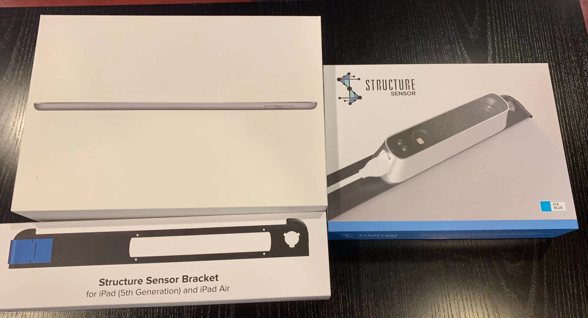
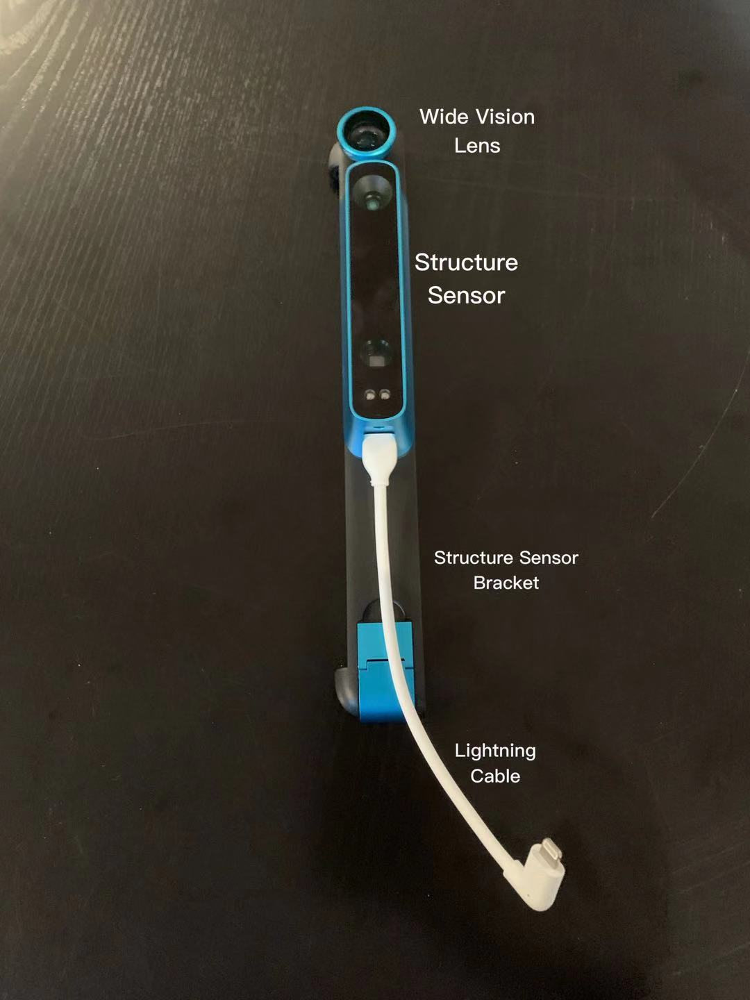

# OccipitalStructureSensor
With the Structure Sensor, the future is in your hands. Rapid 3D scanning of objects and people, 3D maps of interior spaces, and mixed reality experiences where fantasy becomes impossible to tell from reality.

## Content

* [Where To Find](#where-to-find)
* [In The Box](#in-the-box)
* [Apps from Occipital](#apps-from-occipital)
* [Functions and Usages](#functions and Usages)
* [SDK](#sdk)
  * [Bridge Engine](#bridge-engine)
  * [Structure SDK for iOS](#structure-sdk-for-ios)
  * [Access the SDK](#access-the-sdk)
* [Putting The Device Back](#putting-the-device-back)
* [More Documentations](more-documentations)

## Where To Find
Storage Room - A2

## In The Box
The structure sensor is already assembled together with the structure sensor bracket and the wide vision lens. You just need to connect it with the provided iPad and start your journey. If the iPad cannot detect the sensor, try reconnect the lightning cable.
The things you should have: One Structure Sensor, One Lightning cable, One Power Adapter, One magnetic screwdriver, Eight (8) M1.6 screws.

Power Adapter: To preserve the battery life of your iPad, Structure Sensor has its own internal battery. Connect the supplied Power Adapter to the barrel jack (aka the rounded port) on the side of the Structure Sensor, and then plug the other end into any standard 2-pronged wall outlet.

USB Hacker Cable is needed when using Structure Sensor with a non-iOS Device.

## Apps from Occipital
* Calibrator: This app is used for calibrating your stucture sensor to your iOS device. It includes calibrating bracket to your iOS camera, calibrationg a Wide Vision Lens, Indoor Mode and other advanced features. You can download and print the checkerboard pattern from this link https://structure.io/checkerboard.
* Scanner: This app is used to scanner an object within a view and display the result in three ways (X-Ray View, Shaded View and Color View).
* Structure: This app is the first app for the Structure Sensor available on the App Store. It includes a number of visualizations to show the raw data being captured and streamed by your Structure Sensor to your iPad. The manuals of Structure App is availuable and you can check it through this link https://structure.io/structure-sensor/getstarted/first-use.

## Functions and Usages
The main function of structure sensor is to scan and record the objects. The scanning is achieved by measuring the basic scale, depth and color. Below is the list of its usage, you can quickly go through it, try the existing Apps and hope it will give you some inspiration when developing your own App. 
1. 3D scanning: Capture scale accurate 3D models of people, objects and places with your iPad. e.g.of Apps: itSeez3D.
2. Canvas: It is an application made by Occipital. It creates a scale-accurate 3D model of a home in minutes — all on iPad. You can measure, review or share your model on-device instantly, or convert it for popular CAD programs like SketchUp, AutoCAD, and Revit.
3. Medical Application: Simple, precise 3D scanning for orthotics and prosthetics. e.g. of Apps: 3DsizeME.
4. Education: The mobile 3D sensor used by teachers and students to capture environments and impact imagination; enabling learning through 3D scanning, 3D printing, science, math, VR and storytelling. e.g. of lessons: Science & Math
5. Bridge Headset: Bridge is a revolutionary device that brings both positionally tracked virtual reality and mixed reality to a mobile headset. 
6. AR/VR Positional Tracking: Occipital is a pioneer in bringing unbounded 6-DoF positional tracking to virtual reality and mixed reality systems. Adding Structure Sensor to your HMD adds highly efficient, low latency, low jitter inside-out positional tracking that levels up any VR experience. Stucture and SDK sample:Stacker.
7.Embedded Installations: Structure Sensor is designed for easy customization and rapid integration for projects that require precise 3D vision. It’s also OpenNI ready for simple substitution in systems using obsolete, out-of-production depth sensors.
8.Body Scanning: Capture high quality detail of the human form for fashion and fitness applications. Structure Sensor is ideal for ordering custom-fit footwear and clothing, or for tracking body shape over time. e.g. of Apps: Fit3D.

## SDK

Using the sdk you can create iOS Apps with 3D Sensing. Structure SDK for iOS comes complete with drop-in prefabs for Unity, and a robust SceneKit sample for use with Structure Sensor. You can even create ultra-low-latency Mixed reality apps with Bridge Engine and the Bridge headset, currently available as a separate package.

### Bridge Engine
Bridge Engine is Occipital's next-generation mixed and virtual reality software. Create new experiences with unprecedented 6-DoF movement and bring virtual characters, like our little friend Bridget, into the real world.

### Structure SDK for iOS
Structure SDK provides developers with a stable, easy-to-use, flexible and constantly-improving framework for creating iOS applications in Xcode which leverage advanced computer vision techniques. The SDK download includes:
    * Structure.framework for Xcode 
    * Source code for Unbounded Tracker, Room Capture, Scanner, Viewer, and Unity-based Samples (Unbounded Tracker, and AR Samples)
    * API Documentation

### Access the SDK
To access the SDK you need to visit the structre sensor website and become a developer by registering a new account. Go to this link https://developer.structure.io/sdk to get started. 

## Putting The Device Back
After finish using the device, it is important to turn off, disassemble and put it back in the box as it was found, then put the box back in its place.

## More Documentations
More documentations and materials to download could be found here https://structure.io/ .
